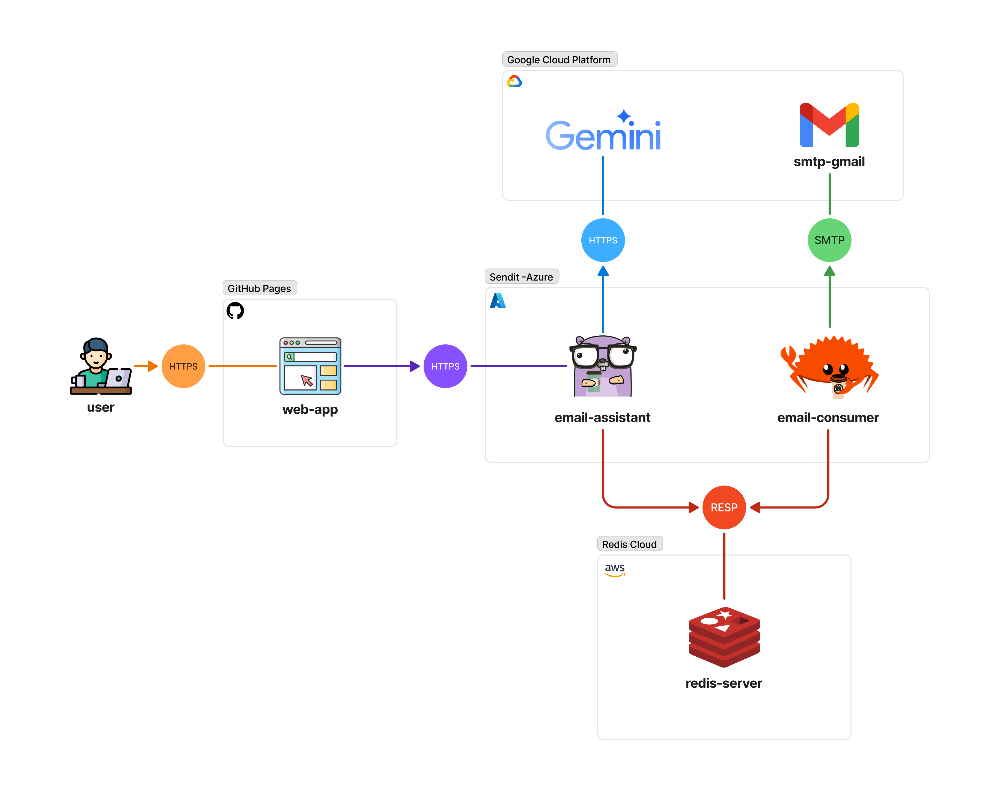

# sendit

Aplicación que permite el envío de emails de forma masiva mediante una arquitectura orientada a eventos y basada en microservicios. En la siguiente imagen se puede observar el flujo de la aplicación, la cual está diseñada con fines educativos y de demostración.



## Distribución de la Aplicación:

La aplicación se encuentra distribuida en los siguientes servicios:

- `email-assistant`: Servidor que se encarga de recibir las solicitudes de envío de emails, de validarlos con ayuda de inteligencia artificial y de producir eventos al servicio de eventos para posteriormente ser procesados por el servicio de `email-consumer`.
- `email-consumer`: Servidor que se encarga de consumir los eventos de redis y de enviar los emails.
- `redis-server`: Servidor de eventos que se encarga de almacenar los eventos producidos por el servicio `email-assistant` y de distribuirlos al servidor `email-consumer` para su procesamiento. Este servicio es de uso opcional, ya que se puede usar un servidor de eventos externo.

## Ejecución del Proyecto:

### 1. Variables de Entorno:
- Las siguientes variables de entorno son requeridas para la ejecución del proyecto completo. Para cada servicio se debe crear un archivo `.env` en su carpeta respectiva, con las variables de entorno necesarias para su ejecución.

    - **Filtro de logs**: Definir el valor de la variable con el nivel de logs que se desea obtener. Se sugiere usar el nivel `debug` para obtener todos los logs.

        ```
            LOG_LEVEL="debug"
            ALLOWED_ORIGINS (comma separated list of allowed origins)
        ```

    - **Credenciales de Redis**: Definir las credenciales y los parámetrospara conectarse con el servidor de eventos:

        ```
            REDIS_USERNAME
            REDIS_PASSWORD
            REDIS_HOST
            REDIS_PORT
            REDIS_DB
        ```

        En caso de decidir usar el servicio de redis que se encuentra en el archivo `docker-compose.yml`, se debe definir las credenciales y los parámetros de conexión con el servidor de redis siendo consecuentes con los parámetros usados en el archivo `./redis-server/redis.conf` y en el archivo `docker-compose.yml`.

        ```
            REDIS_USERNAME="senditusr"
            REDIS_PASSWORD="redispassword"
            REDIS_HOST="redis"
            REDIS_PORT="6379"
            REDIS_DB="0"
        ```

    - **Nombre del stream de Redis**: Definir el nombre del stream que se desea usar.

        ```
            STREAM_NAME_EMAIL_QUEUE="sendit/email-queue"
        ```

    - **Configuración de Grupo de Consumidores**: Definir los parámetros de configuración del grupo de consumidores. Se sugiere usar los siguientes valores:

        ```
            CONSUMER_GROUP_NAME_SEND_EMAIL="send-emails"
            CONSUMER_OPTIONS_SINCE_ID="0-0"
            CONSUMER_OPTIONS_NEW_MESSAGES_COUNT="1"
            CONSUMER_OPTIONS_PENDING_MESSAGES_COUNT="1"
            CONSUMER_OPTIONS_CLAIMED_MESSAGES_COUNT="1"
            CONSUMER_OPTIONS_MIN_IDLE_TIME_MILLISEC="30000"
            CONSUMER_OPTIONS_BLOCK="5000"
            KEY_EMAIL_DATA="data"
        ```

    - **Configuración de Email**: Definir los parámetros de configuración del email.

        ```
            EMAIL_RELAY
            EMAIL_USERNAME
            EMAIL_PASSWORD
        ```

    - **Configuración de Gemini**: Definir las credenciales de la API de Gemini.

        ```
            GEMINI_API_KEY
            GEMINI_MODEL
        ```

### 2. Ejecución:

Se brindan dos comandos para ejecutar el proyecto, donde el primero incluye la ejecución del servidor, el consumidor de emails y el servidor de eventos de redis mientras que el segundo solo incluye la ejecución del servidor.

- **Modo 1**: Ejecución del proyecto completo. Este modo es útil para usar el servidor de eventos de redis que se encuentra en el proyecto.

    ```bash
        sudo docker-compose up --build
    ```

- **Modo 2**: Ejecución del servidor y el consumidor de emails. Este modo es útil para usar un servidor de eventos externo al proyecto.

    ```bash
        sudo docker compose up email-assistant email-consumer
    ```

Los siguientes comandos son útiles para detener el proyecto:

- **Detener todos los contenedores del proyecto**:

    ```bash
        sudo docker compose down
    ```

- **Detener algún contenedor en específico**:

    ```bash
        sudo docker compose down <nombre_del_contenedor>
    ```
